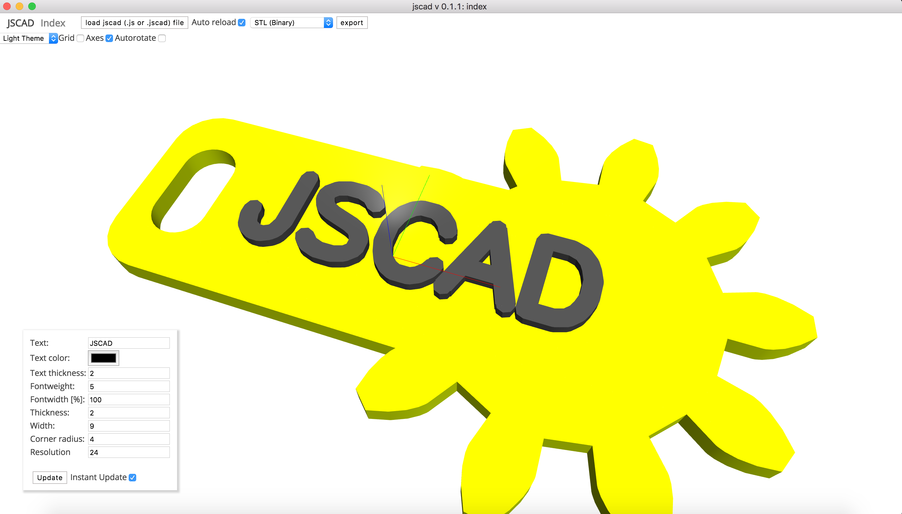

# hannoverjs-jscad-nametag

>3d printable nametag created for hannover.js presentation about jscad (parametric cad in javascript)

## usage

drag & drop index.js onto the loading area of [openjscad.org](https://openjscad.org/), or load it via the [desktop app](https://github.com/jscad/jscad-desktop)

Edit the code , change the parameters to see the changes and have fun!

## license
Everything licensed under MIT , unless specified otherwise